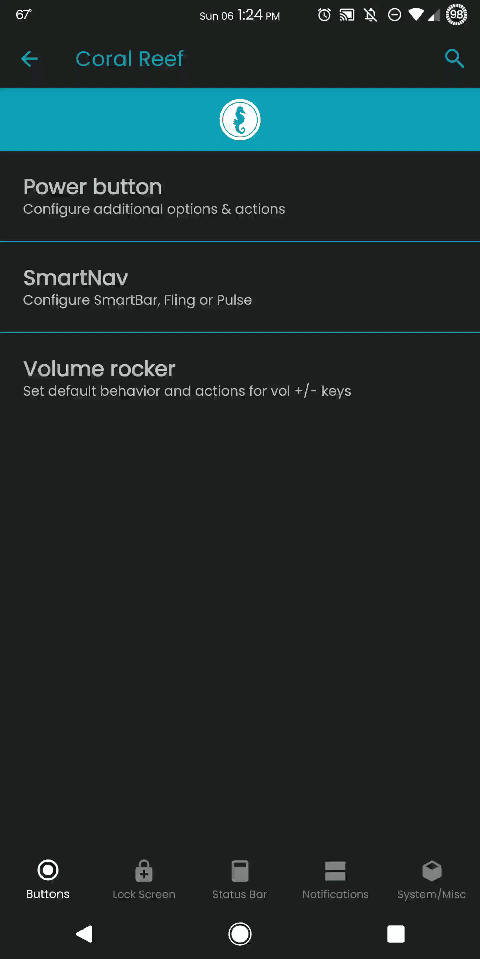

# CoralReef

### About
Give your project the energy it needs to stand out with this bottom-tabbed, swipeable
navigation system. CoralReef was originally started by the Dirty Unicorns leader, Alex Cruz,
as their awesome new custom settings fragment called [DU-Tweaks](https://github.com/DirtyUnicorns/android_packages_apps_DU-Tweaks). @Calebcabob, the AquariOS
team leader then forked, restructured and transformed the app. It has since developed a strong
personality and life of it's own! Give this unique and sexy alternative to the commonly used
AOSP __SettingsPreferenceFragment__ a try!

### See it in action below

Customizing certain elements of this app is quite straight-forward!

| Key                                         | Type    | Description                                                        |
| :-----------------------------------------: |:-------:| :-----------------------------------------------------------------:|
| `bottom_nav_<tab_title>`                    |  string | See __CoralReef.java__ and adjust these strings and keys as needed |
| `BottomBarBackgroundColor`                  |  color  | Accent color control for the background of bottom navigation tabs  |
| `bottom_nav_text_icon_active`               |  color  | Accent color control for the active tab                            |
| `bottom_nav_text_icon_inactive`             |  color  | Accent color control for the inactive tab                          |
| `preference_background_color`               |  color  | Accent color control for the header background in each tab         |
| `top_banner_icon_color_white_accent`        |  color  | Accent color control for icons in tab headers                      |
| `design_bottom_navigation_text_size`        |  dimen  | Controls the size of text in all inactive tabs (not selected)      |
| `design_bottom_navigation_active_text_size` |  dimen  | Controls the size of text for any selected/active tab              |

## Licensing Info

    Copyright (C) 2019 AquariOS
    Copyright (C) 2017 The Dirty Unicorns Project

    Licensed under the Apache License, Version 2.0 (the "License");
    you may not use this file except in compliance with the License.
    You may obtain a copy of the License at

       http://www.apache.org/licenses/LICENSE-2.0

    Unless required by applicable law or agreed to in writing, software
    distributed under the License is distributed on an "AS IS" BASIS,
    WITHOUT WARRANTIES OR CONDITIONS OF ANY KIND, either express or implied.
    See the License for the specific language governing permissions and
    limitations under the License.
